# Tompang Carpool

Tompang Carpool is a carpooling app, where drivers are matched with riders on similar routes to carpool together, reducing carbon emissions and saving the environment!

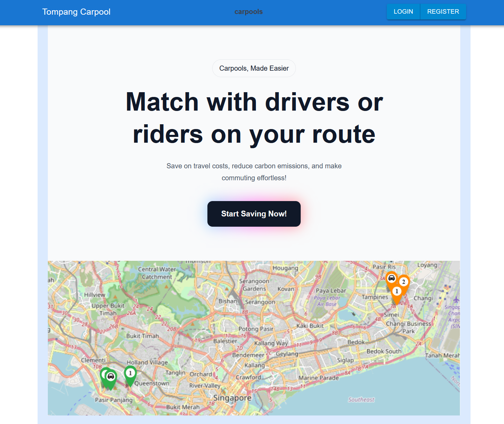

## Usage

### How to run 

The application has been dockerized. After cloning the repo, simply run
```
docker-compose up
```
Then the client can be accessed on `localhost:8080` by default

Note: initial build times for some spring-boot services may take more than 5-10 minutes. Subsequent build times will be shorter.

### Optional Configuration

Since this application uses AWS, localstack is used for emulation as a docker-compose service so you do not have to create an AWS account. This has been configured in `aws.env`.
```
# aws.env - running using localstack emulation

AWS_ACCESS_KEY_ID=test
AWS_SECRET_ACCESS_KEY=test
AWS_ENDPOINT=http://localstack:4566
AWS_BUCKET_NAME=tompang-carpool
AWS_IS_LOCAL=true
```

Alternatively, if you want to use AWS without emulation
```
# aws.env - running using AWS

AWS_ACCESS_KEY_ID=replace with real aws access key
AWS_SECRET_ACCESS_KEY=replace with real aws secret key
AWS_BUCKET_NAME=tompang-carpool
AWS_IS_LOCAL=false
# AWS_ENDPOINT not required as don't need to override the default AWS endpoint
```

Note: application uses OneMapAPI which requires an account. For your convenience, a burner account has been provided for demo. But you can configure your own in the environment.


### Video Demo

#### Coming Soon!

## Contents

- [Architecture and Tech Stack](#architecture-and-tech-stack)
- [Services/Components](#servicescomponents)
    - [API Gateway](#api-gateway)
    - [Carpool Service](#carpool-service)
    - [Chat Service](#chat-service)
    - [Driver Service](#driver-service)
    - [Driver Verification Service](#driver-verification-service)
    - [Geospatial Service](#geospatial-service)
    - [Notification Service](#notification-service)
    - [WebSocket Service](#websocket-service)
- [Security](#security)
- [Resources](#resources)
- [Backlog](#backlog)

# Architecture and Tech Stack

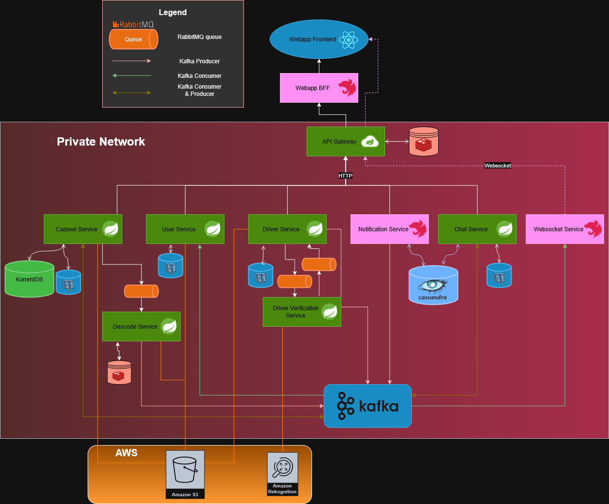

Tompang is built with a event-driven, microservices architecture, built with following technologies.

#### Frameworks

* **Spring Boot**: Most backend services.
* **NestJS**: Some backend services.
* **React**: Webapp client.

#### Communication

* **Kafka**: Primary message broker for event-driven communication between services.
* **RabbitMQ**: Queue for jobs like geocoding jobs or driver verification.
* **Spring Cloud Gateway**: API gateway.
* **Socket.IO**: Websocket communcation between servers & clients.

#### Databases

* **PostgreSQL**: Standard relational database for most services.
* **KurrentDB** (formally known as EventStoreDB): Event native database/eventstore for services using event sourcing(eg. Carpool service).
* **Cassandra**: Distributed database for services with high read & write (eg. Notification & Chat services).
* **Redis**: Lightweight caching.
* **AWS S3**: Cloud storage for images etc.

#### Misc

* **Avro**: Schema generation and event serialization & deserialization for Kafka topics with the Schema-Registry.
* **Leaflet**: Map library for UI.
* **OneMapAPI**: For geolocation data (eg. address name, map images).
* **JUnit + Mockito**: Java unit tests.
* **AWS Rekognition**: Computer Vision AI service for driver verification.
* **Localstack**: Local emulation of AWS.

# Services/Components

## API Gateway

The API gateway service acts as the HTTP & Websocket entrypoint for the backend services, using the Spring Cloud Gateway framework. It also handles authentication and authorization of all incoming requests using JWTokens carrying userId and roles credentials, then attaching `X-User-Id` and `X-User-Roles` to all authenticated & authorized incoming requests.

## Carpool Service

The carpool service is responsible for managing Carpools (created by drivers) and Ride Requests (created by riders) and matchmaking of Carpools and Ride Requests. It uses the CQRS pattern along with Event-Sourcing to have a auditable log of events.

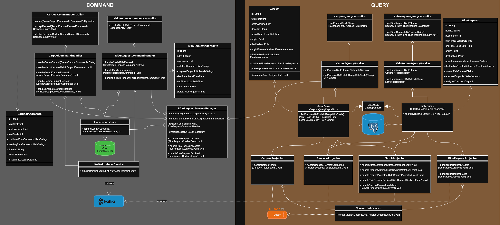

In general, any commands invoked on the command side will raise an event, which is published on kafka and appended to the event store KurrentIO. The event store stream it is appended to correspond to the aggregate and the aggregate id(eg. carpool_a12b-23xv-234x-asdb, ride-request_bg76-898s-sd87-kjh3). The event store supports concurrent operations by verifying the latest version number of the stream when appending events, rejecting the append operation if the version number is outdated.

The projectors on the query side will consume the kafka event if relevant, and update the query specific database view of the entity on PostgreSQL. For some complex operations, the command-side `ProcessManager`s might access the query-side database view, which is only eventually consistent. However for most commands, the `CommandHandler`s will rehydrate aggregates using eventsfrom the event store to perform validations, which has strong consistency.

The following diagrams demonstrate the sequence of events for some commands when invoked.

### Create Carpool Command

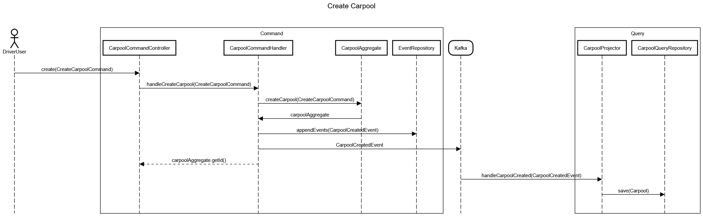

When the `CreateCarpoolCommand` is invoked, the command handler creates a `CarpoolAggregate` using the command. The aggregate raises the `CarpoolCreatedEvent` which is appended to the event repository and published to Kafka. On the Query side, the projector consumes this events and updates the query view database accordingly.

### Create Ride Request Command

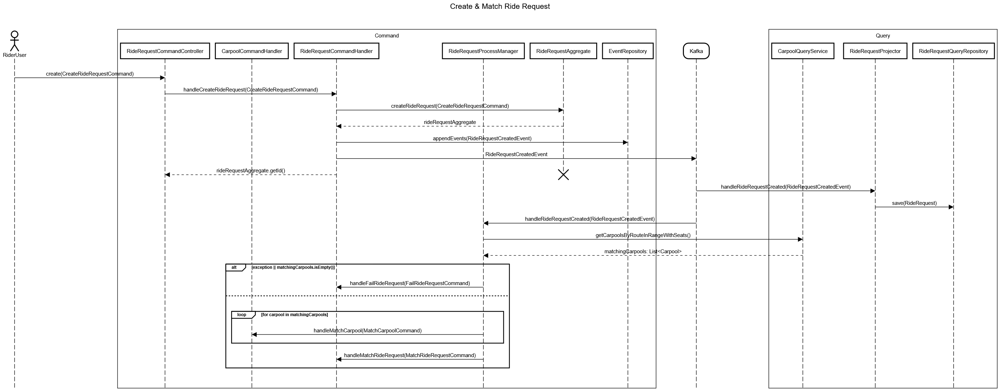

When the `CreateRideRequestCommand` is invoked, the command handler creates a `RideRequestAggregate` using the command. The aggregate raises the `RideRequestCreatedEvent` which is appended to the event repository and published to Kafka. On the Query side, the projector consumes this events and updates the query view database accordingly. 

The `RideRequestProcessManager` also consumes this event and is responsible for matching the ride request with suitable carpools after it is created. It queries the `CarpoolQueryService` on the query side to find matching carpools based on  the ride request details like timerange & route. If no matching carpools are found, the ride request is marked as failed by invoking the `FailRideRequestCommand`. Else, for each matching carpool, the `MatchCarpoolCommand` is invoked between that carpool and the ride request. Finally the `MatchRideRequestCommand` is also invoked for the ride request.

`RideRequestProcessManager` queries from `CarpoolQueryService` despite having to cross the command-query boundary because it is too costly to rehydrate all carpools in order to find matches to the created Ride Request. Therefore we query from the query-side projection to find matches, which is only eventually consistent but sufficient for this purpose.

### Handle MatchCarpoolCommand

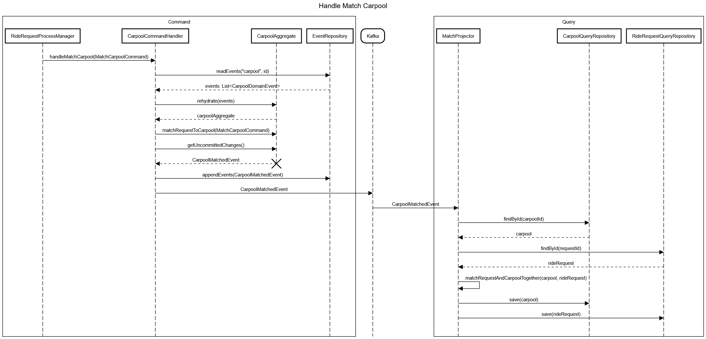

`RideRequestProcessManager` invokes the `MatchCarpoolCommand` which contains:
* `requestId`
* `carpoolId`

The command handler fetches the list of past events for that carpool aggregate from the event repository. It creates the `CarpoolAggregate` by rehydrating it from the event history and invokes the command on the aggregate. The aggregate raises the `CarpoolMatchedEvent` which is appended to the event repository and published to Kafka. On the query side, the `MatchProjector` consumes the event and updates the Carpool and RideRequest entities by matching them together.

### Handle MatchRideRequestCommand

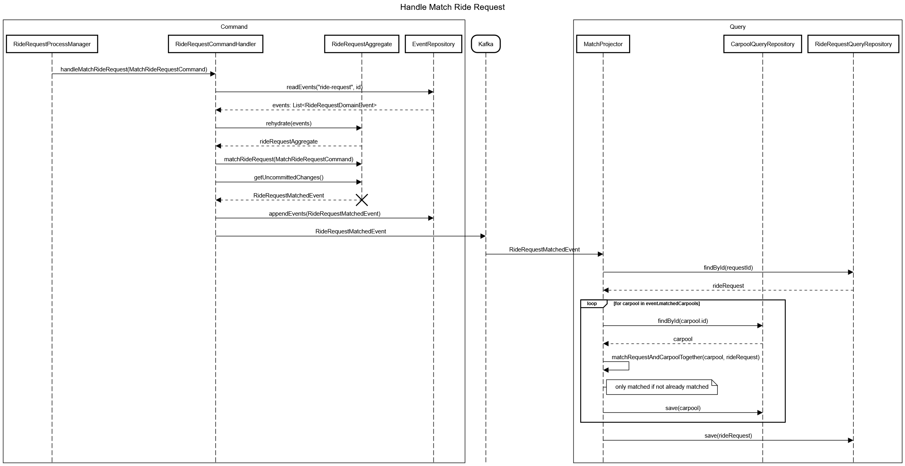

`RideRequestProcessManager` invokes the `MatchRideRequestCommand` which contains:
* `requestId`
* `matchedCarpoolIds`

The command handler fetches the list of past events for that ride request id from the event repository. It creates the `RideRequestAggregate` by rehydrating it from the event history and invokes the command on the aggregate. The aggregate raises the `RideRequestMatchedEvent` which is appended to the event repository and published to Kafka. On the query side, the `MatchProjector` consumes the event and fetches the RideRequest & all Carpools from `matchedCarpoolIds` entities and updates them by matching them together.

### Accept Carpool Request


`AcceptCarpoolRequestCommand` contains:
* `requestId`
* `carpoolId`
* `leftoverCarpoolIds`: ids of all other carpools in the request was matched to.

When invoked by the command controller, the command handler rehydrates the `CarpoolAggregate` and `RideRequestAggregate` from event history of fetched from the event repository for those `requestId` and `carpoolId` streams. Then it checks if the `RideRequestAggregate` can be assigned to a carpool, throwing a `BadRequestException` if it can't be assigned. Else, the command is invoked on both aggregates, raising the `CarpoolRequestAcceptedEvent` and `RideRequestAcceptedEvent` events, appending to the event repository and publishing to Kafka.

`MatchProjector` on the Query side consumes the `RideRequestAcceptedEvent` event and updates the RideRequest by removing it from all of its matchedCarpools' pendingRideRequests list. Then it assigns the RideRequest and Carpool together.

`RideRequestProcessManager` also consumes the `RideRequestAcceptedEvent` event and invokes the `InvalidateCarpoolRequestCommand` to all carpools in `leftoverCarpoolIds`, as the riderequest is already assigned, so all the requests made to these carpools are now invalid.

### Handle InvalidateCarpoolRequestCommand

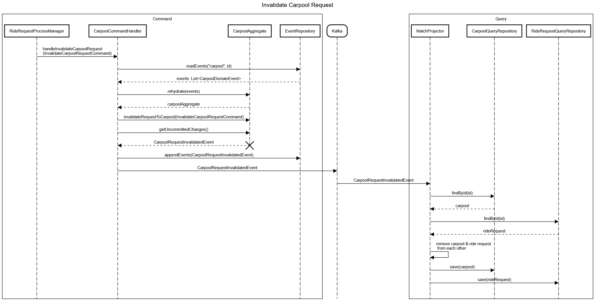

`InvalidateCarpoolRequestCommand` contains:
* `carpoolId`
* `requestId`
* `reason`

When invoked by the `RideRequestProcessManager`, the command handler fetches the list of past events for that carpool id from the event repository. It creates the `CarpoolAggregate` by rehydrating it from the event history and invokes the command on the aggregate. The aggregate raises the `CarpoolRequestInvalidatedEvent` which is appended to the event repository and published to Kafka. On the query side, the `MatchProjector` consumes the event and fetches the RideRequest Carpool entities and updates them by removing them from each other's matched/pending lists.

### Decline Carpool Request

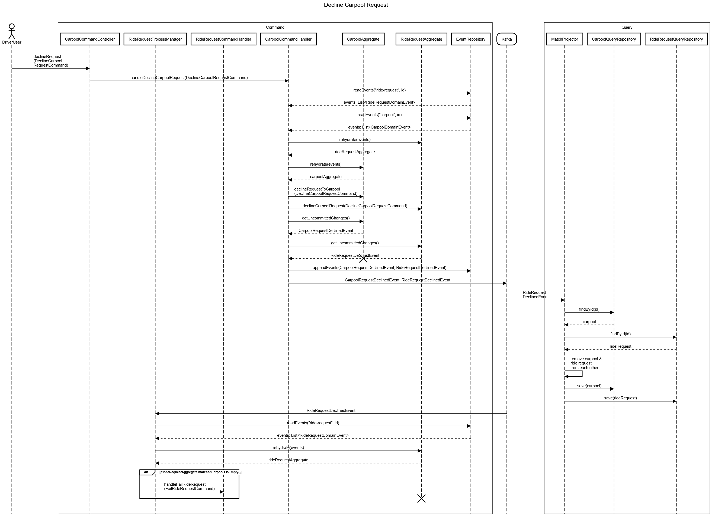

`DeclineCarpoolRequestCommand` contains:
* `carpoolId`
* `requestId`

When invoked by the controller, the command handler rehydrates the `CarpoolAggregate` and `RideRequestAggregate` from event history of fetched from the event repository for those `requestId` and `carpoolId` streams. Then it invokes the command on both aggregates, raising the `CarpoolRequestDeclinedEvent` & `RideRequestDeclinedEvent` events, appending to the event repository and kafka.

The `MatchProjector` in the Query side consumes `RideRequestDeclinedEvent` and update the Carpool and RideRequest entities in the query view database by removing them from each other's matched/pending lists.

`RideRequestProcessManager` also consumes `RideRequestDeclinedEvent` and rehydrates the `RideRequestAggregate` with the event history from event repository. Then it checks if there are still any carpools matched to the ride request. If there are no more pending carpool matches, it invokes the `FailRideRequstCommand`.

### Handle FailRideRequestCommand

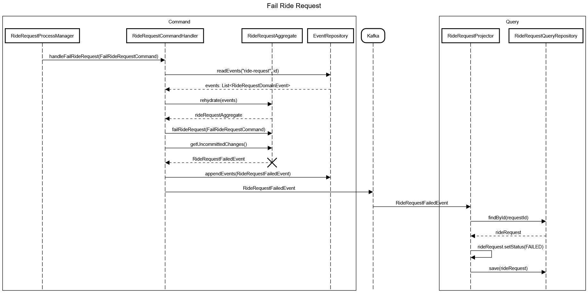

`FailRideRequestCommand` contains:
* `requestId`
* `reason`

When invoked by `RideRequestProcessManager`, the command handler rehydrates the `RideRequestAggregate` with the event history from event repository. Then it invokes the command on the aggregate which raises the `RideRequestFailedEvent`, appending it to the event repository and publishing to Kafka.

On the Query side, `RideRequestProjector` consumes `RideRequestFailedEvent` and updates the RideRequest entity by setting its status to `FAILED`.

## Chat Service

Chat service handles messaging between users in a carpool. Users in a carpool are automatically added into a group chat. This is done via a projector which subscribes to the `carpool-created` & `ride-request-accepted` kafka topics in order to create a projection of all carpools and its users in a PostgreSQL database. Then when a user sends a message to a group, it produces a `chat-message-sent` event for each user in the group, which is consumed by the websocket service which notifies the client that it has received a message via websockets. At the same time, chat service also saves a record of the message in the Cassandra database

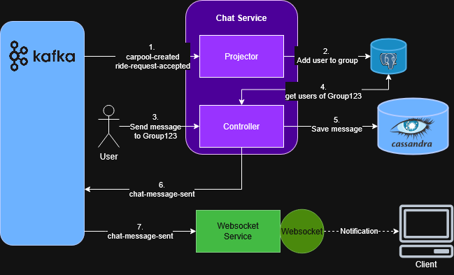

Cassandra is chosen as the database because it excels at handling high-volume, write-heavy workloads with low latency and horizontal scalability. This fits the use case of Chat service because we expect a high volumes of chat messages in group chats, which volume also scales with the size of the userbase.

## Driver Service

TODO

## Driver Verification Service

TODO

## Notification Service

Notification service handles the creation of notifications from events of interest produced by the application. These events include `CarpoolMatchedEvent`, `RideRequestFailedEvent`, `RideRequestMatchedEvent`, `DriverRegistrationApprovedEvent` etc. Notification service subscribes to and conusmes these events from kafka, then creates a common notification record, storing it in the database. Then it produces a `NotificaitonReceivedEvent`, which is consumed by the websocket service to notify the client via websockets.

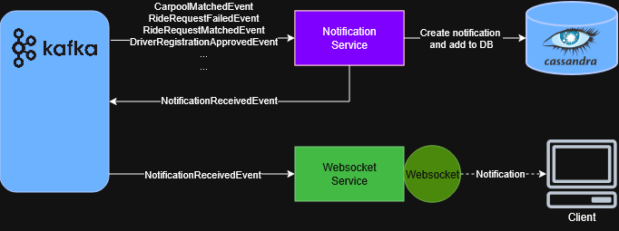

Cassandra is chosen as the database because it excels at handling high-volume, write-heavy workloads with low latency and horizontal scalability. This fits the use case of Notification service where notifications are generated continuously in large volumes that scales with the size userbase.

## Geospatial Service

TODO

## User Service

The user service is responsible for manager users and their profiles, and also registration and logging in of users, generating their JWToken carrying the user's Id and Roles credentials. 

## WebSocket service

Websocket service manages websockets for real-time communication with the clients. It subscribes to relevant Kafka topics: `notificaiton-received` & `chat-message-sent`, then creates an produces a websocket event to the target client.

# Security

Backend services reside inside a private network and are not directly accessible from outside. Only the API gateway is exposed externally which acts as the entrypoint for all all client requests. Authentication and authorization are handled at the gateway using JWTs, where the gateway forwards user identity information (e.g., X-User-Id, X-User-Roles headers) from authenticated requests to internal services. Internal services trust these headers and use them to decide whether the request is allowed. This approach keeps internal services stateless, ensures consistent security across the system, and centralizes authentication while allowing each service to apply its own authorization logic.

# Resources

* Diagrams: [sequencediagram.org](https://sequencediagram.org/), [draw.io](https://draw.io)

# Backlog

* Ratings system
* Payment system
* Route planning
